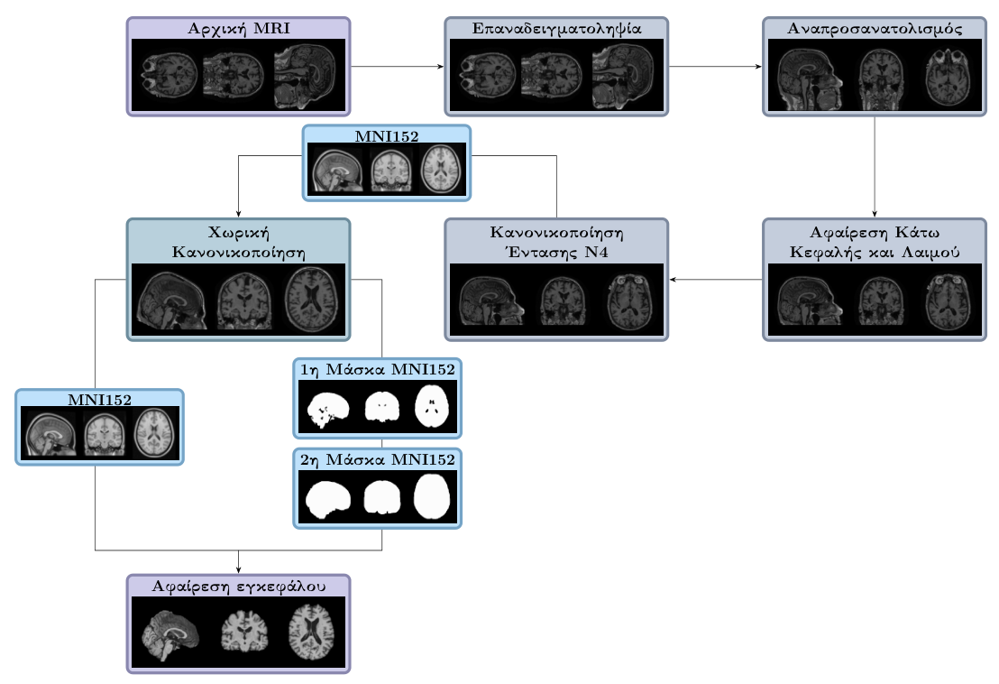
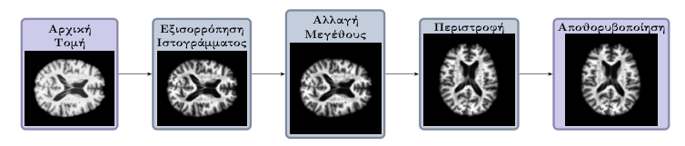
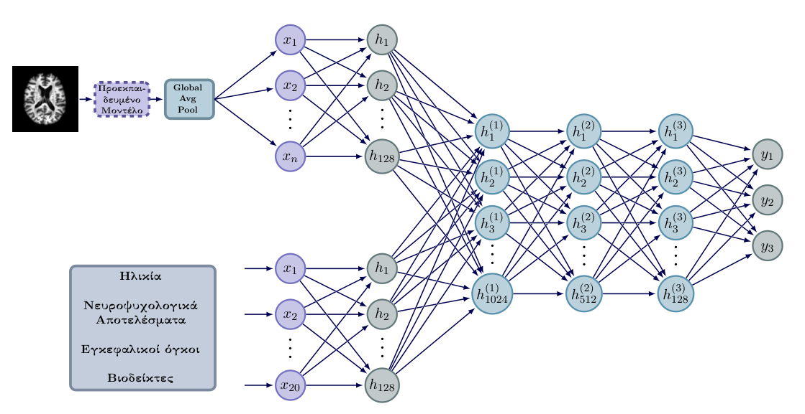
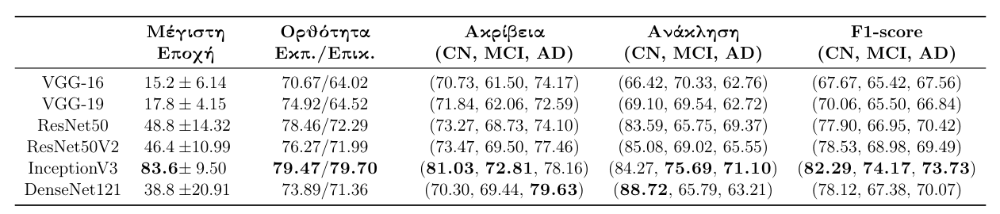

# Multi Modal Deep Learning Model for Alzheimer's Disease Classification

This repository contains the scripts used for the architecture and evaluation of a multimodal deep learning model in order to distinguish between three cognitive states of Alzheimer’s Disease. 
Specifically using data from participants in the ADNI database, the disease’s states are distinguished into Cognitively Normal (`CN`), Mild Cognitive Impaired (`MCI`) and Mild Alzheimer’s Disease
(`AD`). 
The data used, to train the model, included pre-processed 2D axial MRI scans, as well as supplementary metadata. 
The model consists of two sub-networks, extracting the same number of features from the two kinds of data, that are connected to a final network, which performs the categorization of the observations between the three diagnostic groups. 
Specifically, the first sub-network extracts features from the axial slices, using one of the pre-trained CNN models, among `VGG-16`, `VGG-19`, `ResNet50`, `ResNet50V2`, `InceptionV3` and `DenseNet121`, while the second one extracts features from the 20 additional metadata, through a simple artificial neural architecture.

Then, the architecture of the model was evaluated based on its ability to distinguish between all three diagnostic groups, as well as their two-by-two combinations, as well as the performance of the 6 pre-trained CNN models. 
Finally, the best performance is found to be for distinguishing between the `CN` and `AD` groups, while at the same time a decrease in performance was observed in models in which observations of the `MCI` group are used.
Among the pretrained models `InceptionV3` is found to have the best average performance for the `CN vs MCI vs AD` and `CN vs AD` models, while for `CN vs MCI` and `MCI vs AD` models `DenseNet121` and `ResNet50V2`, respectively.

> [!NOTE] 
> This repository does not include the ADNI data. Access requires registration and approval at https://adni.loni.usc.edu/.

## Requirements

### Python Requirements
```
python==3.8.18
numpy==1.19.5
pandas==1.3.4
scikit-learn==1.3.2
tensorflow==2.3.0
matplotlib==3.5.1
opencv-python==4.8.1.78
scikit-image==0.19.3
nibabel==5.1.0
tqdm==4.66.1
```

### Cuda Requirements
```
Cuda==10.1.243
cuDNN==7.6.0.64
```

### Linux System Requirements (WSL) Requirements
```
ANTs==2.5.0.post14-gfe3a0e3
FSL==6.0.7.3
FSLeyes==1.11.0
```


## Dataset

**TLDR**: Modalities used: 2D Axial MRIs extracted from 3D 1.5T MRIs, associated clinical metadata

In this work the normalized collection `ADNI1:Complete 1Yr 1.5T` is used which includes 2294 1.5T MRI scans.
Moreover, the current model uses axial orthogonal brain slices, accompanied by metadata useful for disease detection that including `diagnosis`, `age`, Mini-Mental State Examination (`MMSE`), Clinical Dementia Rating (`CDR`), regional brain volumes (`ROIs`), `biomarkers`, and `neuropsychological summary scores`.

> [!NOTE] 
> This repository does not include the ADNI data. Access requires registration and approval at https://adni.loni.usc.edu/.

### Metadata Preprocessing
In the case of the metadata, features such as ROI volumes were preprocessed to remove scale differences via standardization, while the ratio of biomarker data, which is often used as an indication of the existence of the disease, was calculated.
 
### MRI Preprocessing
Before extracting the axial slices from the MRI scans, a series of processing methods were applied with the main goals of spatial normalization and removal of the skull and tissues, which were are not necessary in the current study.



After extracting 2D orthogonal axial slices, additional preprocessing was applied with the primary goal of reducing noise, as is shown in the image below:

<p align="center">
  
</p>


## Model Architecture
**TLDR**: Parallel branches for 2D MRI (`CNN`) and metadata (`ANN`)

The CNN sub-network receives 2D MRIs and mainly consists of a pre-trained model used for transfer learning, that extracts the same ammount of features as the ANN sub-network.
Many pre-trained models were used including `ResNet50`, `ResNet50V2`, `VGG-16`, `VGG-19`, `InceptionV3` and `DenseNet121`, in order to identify the most suitable model among them for extracting features from the MRIs. 
At the same time, the ANN sub-network receives as input 20 metadata of the corresponding MRIs, and lastly all features from both networks are concatenated and used in the final ANN network that performs the classification. More details are given below:

- **Training Strategy**: `5-Fold CV` with `train-val-test spliting`
- **Loss function**: `Binary Crossentropy` for binary classification, `Sparse Categorical Crossentropy` for multi-class classification
- **Optimizer**: `SGD with Nesterov Momentum`
- **Evaluation Metrics**: `Accuracy`, `Precision`, `Recall`, `F1-score` (used mainly due to data imbalance)




## Repository Structure

* `csv`: Should contain the tables from ADNI containg the MRI metadata.
* `Images`: Contains the images used in the ReadMe.md file
* `DataCleaning`: Contains the scripts used for merging and cleaning the metadata, resulting in csv file used for training the model.
* `PrepareMRIs`: Contains the scripts used for extracting, preprocessing and labeling the MRIs.
* `Model`: Contains the scripts used for configuring and training the model.


## How to Run
**TODO:** Instructions for running the project will be added soon.

## Results

The best performance is found to be for distinguishing between the `CN` and `AD` groups, while at the same time a decrease in performance was observed in models in which observations of the `MCI` group are used.
Among the pretrained models `InceptionV3` is found to have the best average performance for the `CN vs MCI vs AD` and `CN vs AD` models, while for `CN vs MCI` and `MCI vs AD` models `DenseNet121` and `ResNet50V2`, respectively.

### Accuracies


### CN vs MCI vs AD


### CN vs AD

### CN vs MCI

### MCI vs AD

## Acknowledgments

## Status
> Done
